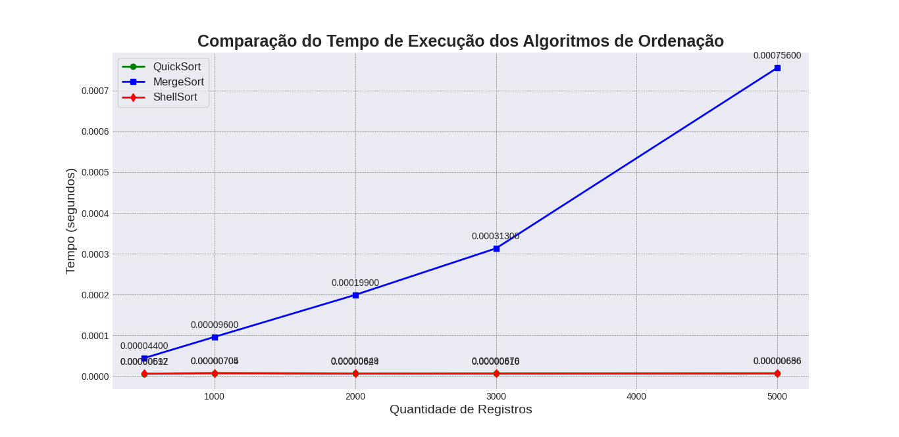

# AED1_Final
Esse repositorio foi criado para a atividade final de AED1 do Instituto de Informatica da UFG. As aulas foram ministradas pelos professores Francisco e Temal Soares. Os alunos responsaveis pela resolução dessa atividade são: Carlos Henrique, Guilherme Frazão e Pedro Saraiva.

Essa atividade e sobre a analise de três algortimos de ordenação, sendo eles:

1. #### ShellSort
2. #### QuickSort
3. #### MergeSort

Nós temos que implemeta-los e testa-los com os arquivos .txt presentes na pasta [arrays](arrays/).
O arquivo com o enunciado original fornecido pelo professor é [PDF](TRAB_FINAL.pdf).

# Enunciados

1. Implemente o algoritmo de ordenação [ShellSort](code/shellSort.c). Teste com os 5 arrays, verifique o tempo de cada array e preencha a tabela abaixo. (feito por *Guilherme Frazão*)
2. Implemente o algoritmo de ordenação [QuickSort](code/quickSort.c). Teste com os 5 arrays, verifique o tempo de cada array e preencha a tabela abaixo. (feito por *Pedro Saraiva*)
3. Implemente o algoritmo de ordenação [MergeSort](code/mergeSort.c). Teste com os 5 arrays, verifique o tempo de cada array e preencha a tabela abaixo. (feito por *Carlos Henrique*)

Esses codigos podem ser acessados na pasta [code](code/)
Os dados que estão na tabela são de valores medios de varias ordenações das listas, decidimos fazer para ter uma precisao estatitisca adequada. Nos deixamos os valores medio pois são mais "limpos" e da para colocar na tabela.

## Tabela Auxiliar

| Algoritmo | Qtd Registros | Tempo |
|-----------|---------------|-------|
| ShellSort | 500           |0.00000612|
| ShellSort | 1000          |0.00000704|
| ShellSort | 2000          |0.00000624|
| ShellSort | 3000          |0.00000616|
| ShellSort | 5000          |0.00000656|
| QuickSort | 500           |0.0000059696|
| QuickSort | 1000          |0.0000070510|
| QuickSort | 2000          |0.0000064948|
| QuickSort | 3000          |0.0000066958|
| QuickSort | 5000          |0.0000068570|
| MergeSort | 500           |0.000044|
| MergeSort | 1000          |0.000096|
| MergeSort | 2000          |0.000199|
| MergeSort | 3000          |0.000313|
| MergeSort | 5000          |0.000756|

4. Construa um gráfico de linha para cada algoritmo onde o eixo X é o tempo e o eixo Y é a quantidade de registros do referido teste.

O grafico pode ser plotado no [visualizador](visualizador_tempo.py) que desenvolvemos.

(esse grafico esta desatualizado)

5. Discorra sobre os pontos fortes e os pontos fracos de cada um dos três algoritmos implementados anteriormente. 
Reposta:

## ShellSort

#### Pontos Fortes:

- **Eficiente para listas de tamanho moderado**: Melhora significativamente sobre algoritmos simples como o Insertion Sort.
- **Pouco uso de memória adicional**: É um algoritmo in-place que não requer memória adicional significativa.

#### Pontos Fracos:

- **Desempenho variável**: A eficácia depende fortemente da escolha da sequência de intervalos.
- **Complexidade**: Não é tão intuitivo quanto algoritmos mais simples, como o Bubble Sort ou o Insertion Sort.

## QuickSort

#### Pontos Fortes:

- **Alto desempenho**: Um dos algoritmos de ordenação mais rápidos para grandes conjuntos de dados, em média.
- **Eficiência de memória**: Trabalha in-place, economizando memória.

#### Pontos Fracos:

- **Performance no pior caso**: Pode degenerar para O(n²) se o pivô for escolhido inadequadamente.
- **Instabilidade**: Não mantém a ordem relativa de registros com chaves iguais.

## MergeSort

#### Pontos Fortes:

- **Performance consistente**: Oferece tempo de execução O(n log n) em todos os casos.
- **Estabilidade**: Mantém a ordem relativa de registros com chaves iguais.

#### Pontos Fracos:

- **Uso de memória:** Requer memória adicional para a operação de merge, o que pode ser um problema para conjuntos de dados muito grandes.
- **Eficiência em listas pequenas**: Pode ser menos eficiente do que outros algoritmos, como o Insertion Sort, para listas pequenas.

Feito por Carlos Henrique, Guilherme Frazão e Pedro Saraiva.
